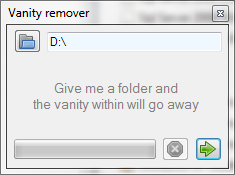

# Project Description

This application removes all sub-folders (and the folder itself) where vanity is found. In other words: Recursivly checks for and deletes empty folders. Simple as that.

## How to use:

* Download and run.
* Select a folder, by either:
** Typing it in to the textbox.
** Choosing it with the folder dialog (click the button next to the textbox).
** Drag and drop a folder from explorer unto the application.
* Press enter or click the green arrow.

## What will happen:

* Progressbar will start having fun.
* Given folder and all sub-folders will be checked recursively for contents. Those that are empty will be deleted.
* Progressbar will stop.
* Number of scanned and deleted folders will be reported.

_**Note:** The given folder itself will also be deleted if it ends up being empty._

## Other uses:

None really. But if you for example would like to learn how you can do a simple drag and drop like that, take a look at the source code :-)
